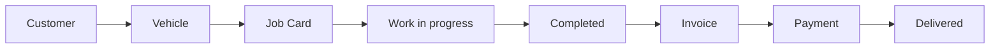
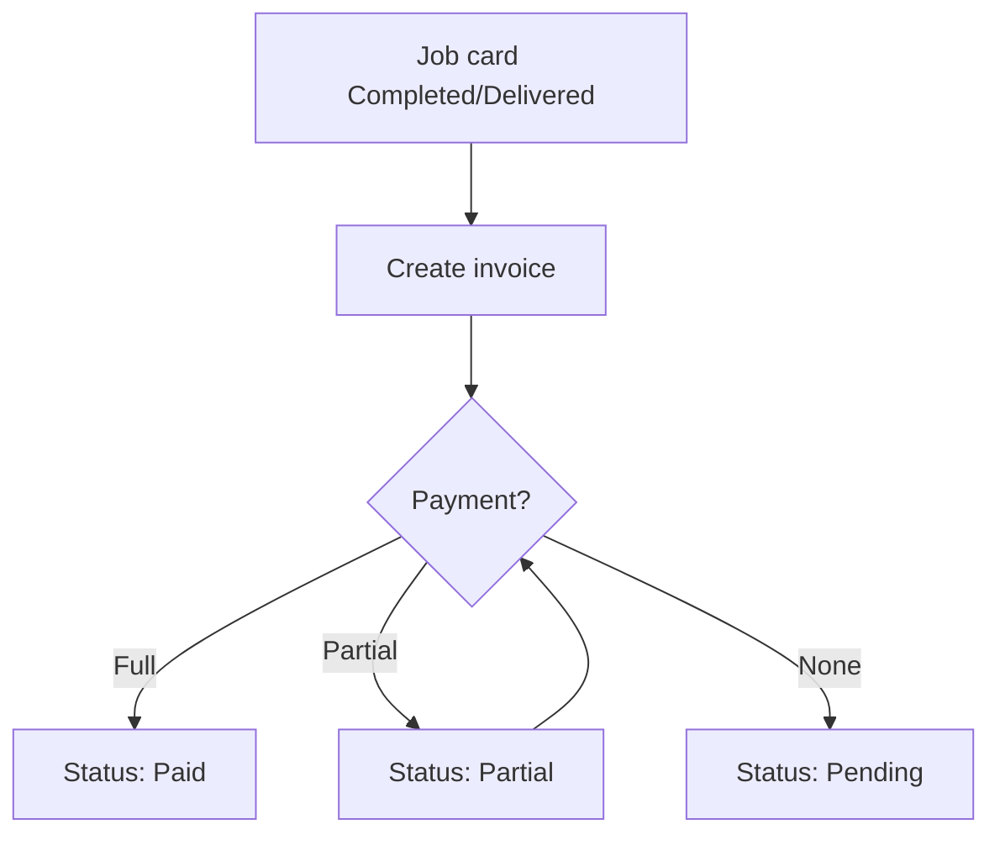
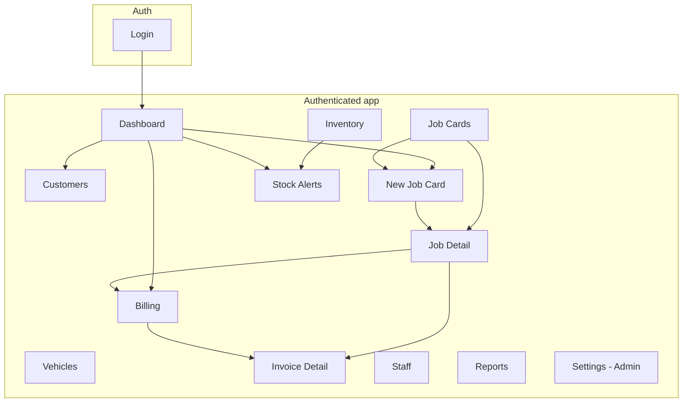

# Workshop Pro — User Flow Guide

Workshop Pro is an **offline-first desktop ERP** for automobile workshops. It runs on Windows and macOS (Electron) and stores all data locally—no internet required after installation.

This document explains **how to use the application**: who can do what, how screens connect, and the recommended day-to-day workflow from customer intake through billing and reporting.

---

## Table of contents

1. [Getting started](#1-getting-started)
2. [Application layout](#2-application-layout)
3. [User roles & access](#3-user-roles--access)
4. [Recommended daily workflow](#4-recommended-daily-workflow)
5. [Module-by-module flows](#5-module-by-module-flows)
6. [End-to-end diagrams](#6-end-to-end-diagrams)
7. [Notifications & alerts](#7-notifications--alerts)
8. [PDFs, printing & file locations](#8-pdfs-printing--file-locations)
9. [Admin: settings & backup](#9-admin-settings--backup)
10. [Quick reference](#10-quick-reference)

---

## 1. Getting started

### Install & run

```bash
npm install
npm run db:push    # create local database
npm run dev        # development
```

For production, use the packaged installer from `npm run pack:win` (Windows) or `npm run pack:mac` (macOS). Output is in `release/`.

### Sign in

On launch you land on the **Login** screen (`/login`). Two modes are available:

| Mode | Who uses it | How |
|------|-------------|-----|
| **Quick PIN** | Staff & mechanics at the counter | Enter 4-digit PIN on the keypad (submits automatically at 4 digits) |
| **Admin** | Workshop owner / administrator | Email + PIN, then **Sign in** |

**Demo credentials** (from seed data):

| Role | Email | PIN |
|------|-------|-----|
| Admin | `admin@workshop.local` | `0000` |
| Staff / Mechanic | (assigned per user) | `1234` |

After a successful login, you are redirected to the **Dashboard** (`/`). The session persists until you sign out.

### Sign out

Click the **logout** icon in the top header. You return to the login screen.

---

## 2. Application layout

Once signed in, the app uses a consistent shell:

```
┌─────────────┬──────────────────────────────────────────┐
│   Sidebar   │  Header (search · notifications · user) │
│  navigation │──────────────────────────────────────────│
│             │                                          │
│             │           Main content area              │
│             │         (page you selected)              │
└─────────────┴──────────────────────────────────────────┘
```

### Sidebar navigation

| Menu item | Route | Purpose |
|-----------|-------|---------|
| Dashboard | `/` | Today’s KPIs, charts, shortcuts |
| Customers | `/customers` | Customer profiles |
| Vehicles | `/vehicles` | Vehicles linked to customers |
| Job Cards | `/job-cards` | Active and past repair jobs |
| Billing | `/billing` | GST invoices & payments |
| Inventory | `/inventory` | Spare parts stock |
| Stock Alerts | `/stock-alerts` | Low / out-of-stock items (badge when count > 0) |
| Staff | `/staff` | Team list & mechanic performance |
| Reports | `/reports` | Revenue & analytics |
| Settings | `/settings` | **Admin only** — workshop profile & backup |

Use **Collapse** at the bottom of the sidebar to shrink it to icons only.

### Header tools

- **Global search** — Type a name, mobile, vehicle, or job hint; press **Enter** to open Customers with that search applied.
- **Notifications** (bell) — Low stock, pending payments, job status alerts; click an item to jump to the relevant page.
- **User chip** — Shows your name and role.
- **Logout** — Ends the session.

---

## 3. User roles & access

| Role | Typical use | Notable access |
|------|-------------|----------------|
| **ADMIN** | Owner, manager | Settings, add staff, full CRUD, backups |
| **STAFF** | Front desk, billing | Customers, jobs, billing, inventory (most screens) |
| **MECHANIC** | Workshop floor | PIN login; can be assigned to job cards |

- **Settings** appears in the sidebar only for **ADMIN**.
- **Add Staff** on the Staff page is shown only to **ADMIN**.
- Some backend actions (e.g. certain deletes) are restricted to admin on the server.

---

## 4. Recommended daily workflow

This is the **standard path** for a vehicle arriving for service:



### Step-by-step

1. **Register or find the customer** — Customers → search or **Add Customer**.
2. **Register the vehicle** — Vehicles → **Add Vehicle** (must link to a customer).
3. **Open a job card** — Dashboard **New job card** or Job Cards → **New Job Card**; pick customer, vehicle, mechanic, complaint, services, and parts from inventory.
4. **Track progress** — Update job status as work moves (Pending → In Progress → … → Completed).
5. **Bill the customer** — When status is **Completed** or **Delivered**, create an invoice from the job card or Job Cards list.
6. **Record payment** — Billing → record Cash / UPI / Card (full or partial).
7. **Deliver vehicle** — Set job status to **Delivered** when the customer picks up.
8. **Review the day** — Dashboard and Reports for revenue and pending amounts.

Shortcuts on the Dashboard: **New job card**, **Add customer**, **Billing**.

---

## 5. Module-by-module flows

### 5.1 Dashboard (`/`)

**Purpose:** Single-screen overview of today’s workshop.

**What you see:**

- Stats: today’s bookings, active jobs, pending deliveries, today’s & month revenue
- Charts: weekly revenue (bar), job status breakdown (pie)
- Widgets: low stock list (links to Stock Alerts), recent customers

**Actions:**

- **New job card** → `/job-cards/new`
- **Add customer** → `/customers`
- **Billing** → `/billing`
- Click a low-stock row → Stock Alerts with that item highlighted
- Click a recent customer → Customers filtered by that customer

---

### 5.2 Customers (`/customers`)

**Purpose:** Store owner contact details and track how many vehicles and jobs they have.

**Flow — add a customer:**

1. Click **Add Customer**.
2. Fill **Name**, **Mobile** (required), optional **Address** and **Notes**.
3. Click **Save**.

**Flow — find or edit:**

1. Use the search box (name or mobile).
2. Click **pencil** to edit or **trash** to delete (confirm dialog).

**Tip:** Create the customer **before** the vehicle and job card.

---

### 5.3 Vehicles (`/vehicles`)

**Purpose:** Each vehicle belongs to one customer; used on every job card.

**Flow — add a vehicle:**

1. Click **Add Vehicle**.
2. Select **Customer**, enter **Vehicle number** (registration), optional brand, model, fuel type, KM reading.
3. Click **Save**.

**Flow — browse:**

- Search by vehicle number or brand.
- Cards show owner name, mobile, and fuel/KM when set.

---

### 5.4 Job cards (`/job-cards`, `/job-cards/new`, `/job-cards/:id`)

**Purpose:** Digital work order—services, parts, mechanic, status, and totals.

#### Create a job card (`/job-cards/new`)

1. **Job details**
   - Select **Customer** (required).
   - Select **Vehicle** (loads vehicles for that customer; required).
   - Optional **Mechanic**, **Complaint**, **Est. completion** datetime.
2. **Services**
   - Default line: “General Service”; add more with **Add**.
   - Per line: name, labor charge (₹), quantity; remove with trash icon.
3. **Spare parts**
   - **+ From inventory** to add a part (uses selling price; deducts stock when saved).
4. Click **Create Job Card** → opens **job detail** page.

#### Job card statuses

| Status | Meaning |
|--------|---------|
| Pending | Booked, not started |
| In Progress | Work underway |
| Waiting for Parts | Blocked on inventory |
| Completed | Work finished, ready to bill |
| Delivered | Vehicle returned to customer |

Change status from the **list row** (where supported) or on the **detail page** via the status dropdown.

#### Job cards list (`/job-cards`)

- Search by job number, customer, or vehicle.
- Filter by status.
- **Click a row** → detail page.
- Row actions (icons):
  - **View** — detail page
  - **Invoice** — only when Completed/Delivered
  - **PDF** — export job card PDF (path shown in alert)
  - **Print** — thermal print

#### Job card detail (`/job-cards/:id`)

- Customer, vehicle, complaint/notes, services, parts, totals (labor, parts, GST, grand total).
- **PDF** / **Print** — same as list.
- **Create invoice** — when Completed/Delivered and no invoice yet; opens billing detail.
- Link to existing **invoice** if already created.

---

### 5.5 Billing & invoices (`/billing`, `/billing/:id`)

**Purpose:** GST invoices tied to job cards; track paid vs pending.

#### Create an invoice

From a **completed or delivered** job card:

- Job Cards list → invoice icon, or  
- Job card detail → **Create invoice**

There is no standalone “blank invoice” flow—invoices come from job cards.

#### Billing list (`/billing`)

- Search by invoice # or customer.
- Filter: Pending, Partial, Paid.
- **Click a row** → invoice detail.
- **Payment** icon → record a payment (modal).
- **PDF** icon → export invoice PDF.

#### Invoice detail (`/billing/:id`)

- Line items from linked job (services & parts).
- Subtotal, GST %, grand total, paid amount, balance.
- **Record payment** — amount, method (**Cash**, **UPI**, **Card**), optional reference.
- Partial payments supported; status becomes Partial until fully paid.
- **PDF** — save invoice to disk.



---

### 5.6 Inventory (`/inventory`)

**Purpose:** Manage spare parts SKUs, quantities, and pricing.

**Flow — add a part:**

1. **Add Part**.
2. Enter SKU, name, category (Engine Parts, Oil, Tires, Electrical, Accessories), quantity, min stock, purchase & selling prices.
3. **Save**.

**Flow — adjust stock:**

- **+10** or **-1** on a row → enter a **reason** (required) → quantity updates.
- Low-stock rows are highlighted; count appears on Stock Alerts sidebar badge.

**Flow — low stock:**

- Click the **Low stock alerts** stat card → Stock Alerts page.

---

### 5.7 Stock alerts (`/stock-alerts`)

**Purpose:** Focused view for parts at or below minimum stock.

**Flow:**

1. Review summary: total alerts, out of stock, below minimum.
2. Filter: **All**, **Out of stock**, **Low**.
3. Per item actions:
   - **Restock to min** — one-click fill up to minimum level.
   - Quick **+ / −** adjustments.
   - Edit **minimum stock** threshold.
   - Call supplier (if phone on file).
4. **Full inventory** — return to Inventory.
5. **Refresh** — reload alert list.

Dashboard and notifications can deep-link here with `?focus=<itemId>` to highlight one row.

---

### 5.8 Staff (`/staff`)

**Purpose:** View team members and mechanic workload.

**Flow — add staff (Admin only):**

1. **Add Staff**.
2. Name, email, phone, PIN, role (Admin / Staff / Mechanic).
3. **Save**.

**Mechanic performance** section shows completed vs active jobs per mechanic.

---

### 5.9 Reports (`/reports`)

**Purpose:** Business analytics and exports.

**What you see:**

- Monthly revenue (paid) vs pending payments
- 6-month revenue chart
- Top customers by spend
- Top services by frequency
- List of invoices with outstanding balance

**Flow — export:**

1. Click **Export PDF**.
2. A summary report is generated; path shown in alert (under Documents/WorkshopPro).

---

## 6. End-to-end diagrams

### Authentication flow

```mermaid
flowchart TD
  Start[App launch] --> Check{Valid session?}
  Check -->|No| Login[/login]
  Check -->|Yes| Dash[Dashboard]
  Login --> PIN[Quick PIN]
  Login --> Admin[Email + PIN]
  PIN --> Dash
  Admin --> Dash
  Dash --> Logout[Sign out]
  Logout --> Login
```

### Navigation map (main routes)



---

## 7. Notifications & alerts

Open the **bell** in the header to see:

| Type | Typical meaning | Action |
|------|-----------------|--------|
| Low stock | Part at/below minimum | Opens Stock Alerts (focused item if applicable) |
| Pending payment | Invoice unpaid | Opens Billing / invoice |
| Job ready / overdue / waiting parts | Job status attention | Opens relevant job card |

- Dismiss one notification or **mark all read**.
- Sidebar **Stock Alerts** badge mirrors the count of active low-stock items.

---

## 8. PDFs, printing & file locations

| Action | Where output goes |
|--------|-------------------|
| Job card PDF | Alert shows full path; default under `Documents/WorkshopPro/` |
| Invoice PDF | Same |
| Report PDF | Same |
| Thermal print | Sends to configured printer via app (no file) |

**Local data (Windows):**

| Data | Location |
|------|----------|
| Database | `%APPDATA%/workshop-pro/data/workshop.db` |
| Uploads / images | `%APPDATA%/workshop-pro/uploads/` |
| Backups | `%APPDATA%/workshop-pro/backups/` |

---

## 9. Admin: settings & backup

**Route:** `/settings` (Admin only)

### Workshop profile

- Workshop name, address, phone, GST number
- Default GST %
- **Save Settings**

Used on printed/PDF invoices and job documents.

### Backup & restore

- **Create Manual Backup** — snapshot of SQLite database.
- **Auto backup** — runs daily when enabled in settings.
- **Restore** — pick a backup from the list; confirm (replaces current data; **restart the app** after restore).

---

## 10. Quick reference

### Primary buttons by screen

| Screen | Main actions |
|--------|----------------|
| Dashboard | New job card, Add customer, Billing |
| Customers | Add Customer, Search, Edit, Delete |
| Vehicles | Add Vehicle, Search |
| Job Cards | New Job Card, Search, Filter status, View, Invoice, PDF, Print |
| New Job Card | Add services/parts, Create Job Card |
| Job Detail | Change status, PDF, Print, Create invoice |
| Billing | Search, Filter status, Payment, PDF, View detail |
| Inventory | Add Part, +10 / -1 adjust, Go to alerts |
| Stock Alerts | Restock, Adjust, Edit min stock, Refresh |
| Staff | Add Staff (Admin) |
| Reports | Export PDF |
| Settings | Save profile, Backup, Restore (Admin) |

### Job → invoice → payment checklist

- [ ] Customer and vehicle exist
- [ ] Job card created with services (and parts if needed)
- [ ] Status updated through workshop stages
- [ ] Status **Completed** (or **Delivered**)
- [ ] Invoice created from job card
- [ ] Payment recorded (Cash / UPI / Card)
- [ ] Invoice PDF generated if customer needs a copy
- [ ] Job marked **Delivered** when vehicle leaves

### Troubleshooting

| Issue | What to try |
|-------|-------------|
| Redirected to login | Session expired; sign in again |
| Cannot see Settings | Sign in as Admin |
| No vehicles on new job card | Select customer first |
| Cannot create invoice | Job must be Completed or Delivered |
| Stock not updating on job | Parts must be added from inventory on job creation |
| App error on screen | Use **Reload app** on the error page |

---

## Related documentation

- [README.md](../README.md) — installation, tech stack, architecture
- Demo seed: `npm run db:seed` for sample customers, jobs, and inventory

---

*Workshop Pro v1.0 — Offline automobile workshop ERP*
